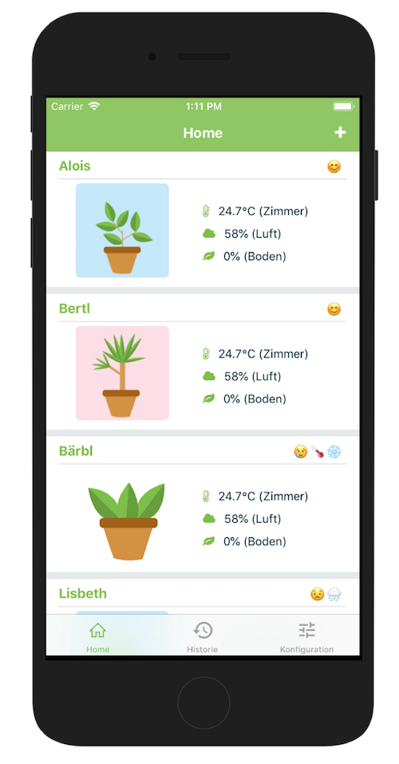
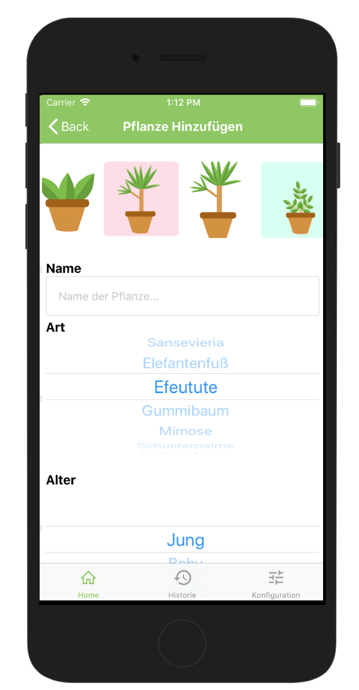
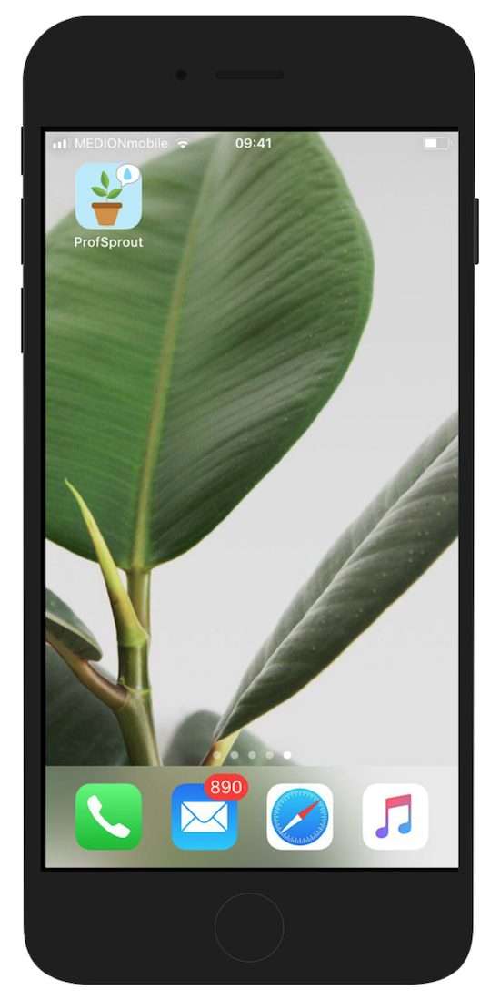

# A Nativescript App for managing IOT-Plants

## Build IOS
- Open Sidekick and make sure a valid developer certificate is available under Build --> Configuration
- Run `tns platform clean ios`
- Run `tns build ios --bundle --clean`
- Open the just built project in XCode (projectname/platforms/ios) and select the ProfSprout.xcodeproj file
- Select a team under "Signing" (e.g. personal team). This requires an apple developer account and a valid developer certificate
- Select your connected Device on the Sidekick main page
    - Under "Manage iOS Provisioning and Certificates" (the wheel icon) auto-generate a certificate and provisioning profile (this requires a free apple developer account)
- Configure the following build settings:
    - Build type: local
    - Build configuration: Release
    - Build typWebpacke: Yes (Checked)
- Press "Run on device" in Sidekick
 
